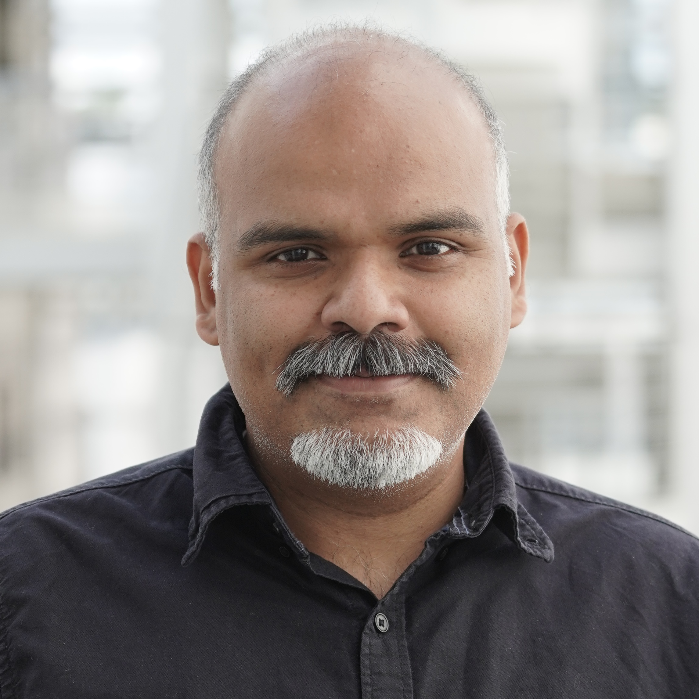
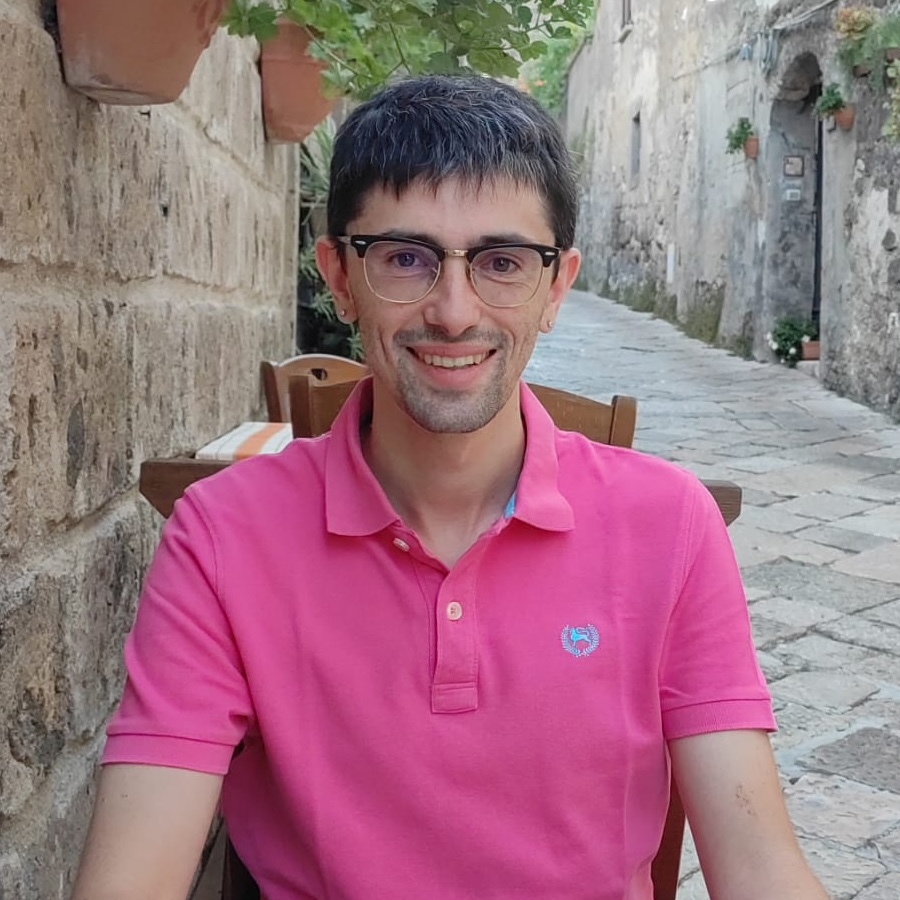

#### Sweden AI Factory

##### Ashwin

::: {.grid}
::: {.g-col-2}
{width=80}
:::
::: {.g-col-10}
This demo course instance uses a simple team-level instructor entry to illustrate how a published
previous course run can look in the template.
:::
:::

##### Ashwin Mohanan, PhD

::: {.grid}
::: {.g-col-2}
{width=80}
:::
::: {.g-col-10}
Ashwin is a researcher in applied artificial intelligence and contributes with his expertise to the following projects:

- Sweden AI Factory ([https://swedenaifactory.se/](https://swedenaifactory.se/))  
- EVITA ([https://www.evitahpc.eu/](https://www.evitahpc.eu/))  
- CodeRefinery ([https://coderefinery.org/](https://coderefinery.org/))  
- ENCCS ([https://enccs.se](https://enccs.se))

He has a background in Mechanical and Aerospace Engineering and has a Ph.D. from Department of Engineering Mechanics,
KTH wherein he studied flows in the atmosphere and the oceans. During his graduate studies he also became proficient 
in open-source development of scientific codes.

Prior to his current role, Ashwin worked for 2.5 years in the Swedish Meteorological and Hydrological Institute (SMHI) as a scientific programmer where he was involved in applications and systems development for production of hydrological forecasts and developing an AI for data rescue of historical weather journals.

The combination of academic and industrial background allows him to find connections between the two worlds and solving complex problems. He is enthusiastic about training and providing technical assistance to enable a sustainable future for all.
:::
:::

##### Ivan Cucchi, PhD

::: {.grid}
::: {.g-col-2}
{width=80}
:::
::: {.g-col-10}
A mathematician by training, Ivan holds a Ph.D. in Computational Mathematics, Learning, and Data Science. His academic journey evolved from modeling cardiac electrophysiology and applying AI to ECG analysis, to merging scientific machine learning with structural bioinformatics. His core expertise lies in combining deep learning architectures with molecular dynamics to model biomolecular systems, evaluate protein stability, and classify ligands. Today, Ivan is an Application Specialist in AI for Life Science at Stockholm University and SciLifeLab, working within the Sweden AI Factory in collaboration with NAISS.
:::
:::

##### Abdul Ghafoor, PhD

::: {.grid}
::: {.g-col-2}
{width=80}
:::
::: {.g-col-10}
Abdul Ghafoor is an Application Security Specialist with over a decade of experience in secure application development and vulnerability assessment. He holds a Ph.D. in Application Security from KTH Royal Institute of Technology (Sweden), where his research focused on secure-by-design applications, shift-left security, and the use of AI in cybersecurity. He specializes in source code analysis and comprehensive risk and vulnerability assessment using manual, automated, and AI-driven techniques, with a strong focus on modern architectures, including microservices and AI pipelines. His work supports critical security needs such as secure data sharing, data sovereignty, and compliance-driven application security.
:::
:::

#### NBIS

##### Marcin Kierczak, PhD

::: {.grid}
::: {.g-col-2}
{width=80}
:::
::: {.g-col-10}
Marcin's doctoral studies have been focused on applying machine learning and AI to predicting protein features and mutation effects. Early on he became interested in xAI 
and worked with the development of novel feature selection and interdependency discovery methods. Later on he focused on statistical learning applied to population genomics 
and epistatic interactions. He is passionate about applying, developing and teaching xAI to lifescience community. Marcin is an associate professor in bioinformatics and 
bioinformatics expert at NBIS. 
:::
:::

##### Lars Eklund, PhD

::: {.grid}
::: {.g-col-2}
{width=80}
:::
::: {.g-col-10}
This demo course instance uses a simple team-level instructor entry to illustrate how a published
previous course run can look in the template.
:::
:::
