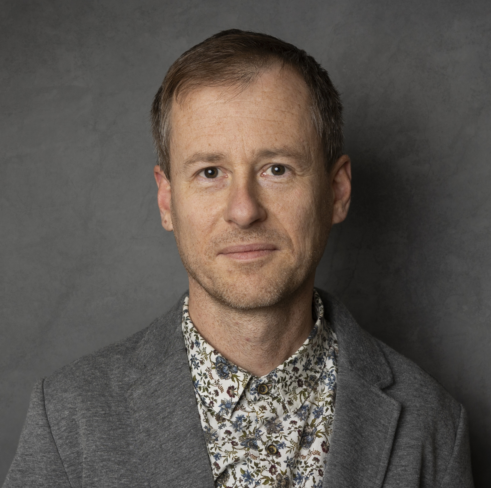

#### Sweden AI Factory

##### Ashwin

::: {.grid}
::: {.g-col-2}
{width=80}
:::
::: {.g-col-10}
This demo course instance uses a simple team-level instructor entry to illustrate how a published
previous course run can look in the template.
:::
:::

##### Ashwin

::: {.grid}
::: {.g-col-2}
{width=80}
:::
::: {.g-col-10}
This demo course instance uses a simple team-level instructor entry to illustrate how a published
previous course run can look in the template.
:::
:::

#### NBIS

##### Marcin Kierczak, PhD

::: {.grid}
::: {.g-col-2}
{width=80}
:::
::: {.g-col-10}
Marcin's doctoral studies have been focused on applying machine learning and AI to predicting protein features and mutation effects. Early on he became interested in xAI 
and worked with the development of novel feature selection and interdependency discovery methods. Later on he focused on statistical learning applied to population genomics 
and epistatic interactions. He is passionate about applying, developing and teaching xAI to lifescience community. Marcin is an associate professor in bioinformatics and 
bioinformatics expert at NBIS. 
:::
:::

##### Lars

::: {.grid}
::: {.g-col-2}
{width=80}
:::
::: {.g-col-10}
This demo course instance uses a simple team-level instructor entry to illustrate how a published
previous course run can look in the template.
:::
:::
